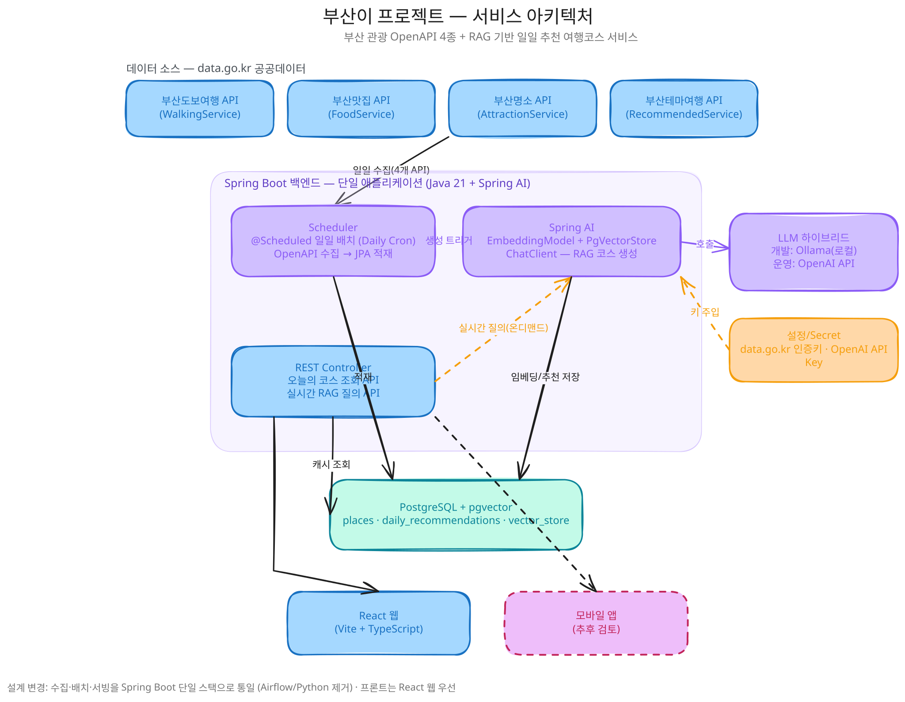

# 부산 아이가! (ma-busan-aiga)

부산시 공공데이터 OpenAPI(도보여행/맛집/명소/테마여행) + RAG 기반 일일 추천 여행코스 서비스

- 백엔드: Spring Boot + Spring AI (Java 21)
- 프론트: React
- 인프라: PostgreSQL(+pgvector), Kubernetes

## 아키텍처

## 문서
- [요구사항 명세서](docs/requirements-spec.md)
- [기능 명세서](docs/functional-spec.md)
- [아키텍처 다이어그램](docs/architecture.svg)
- [백로그](docs/backlog.md)
- [테스트 전략](docs/test-strategy.md)
